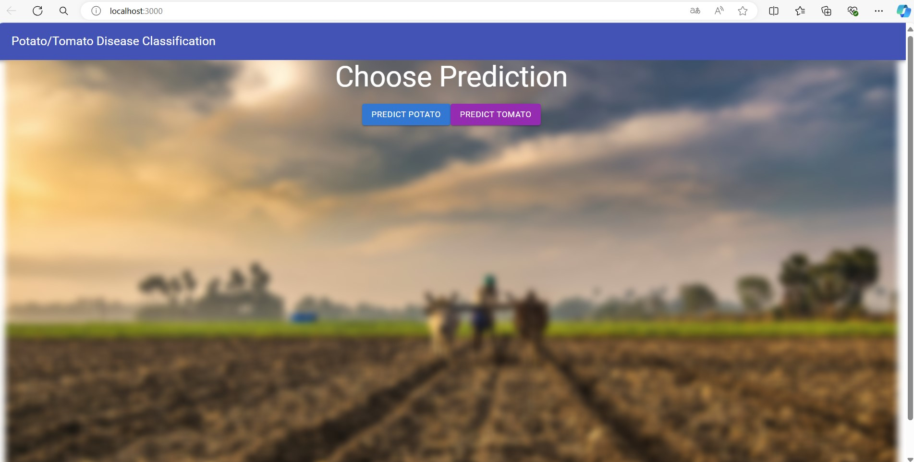
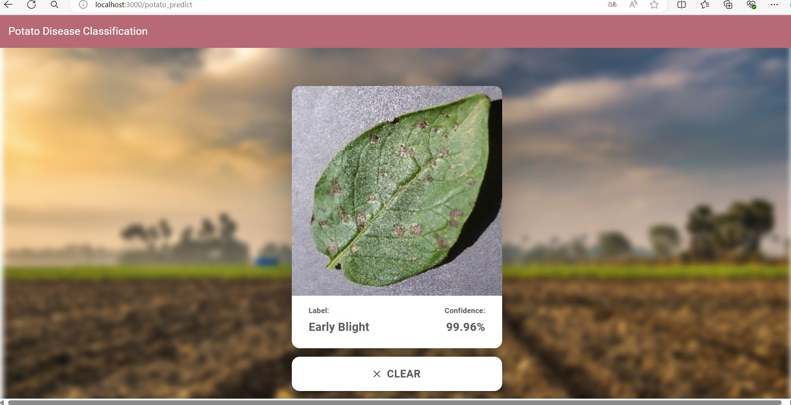
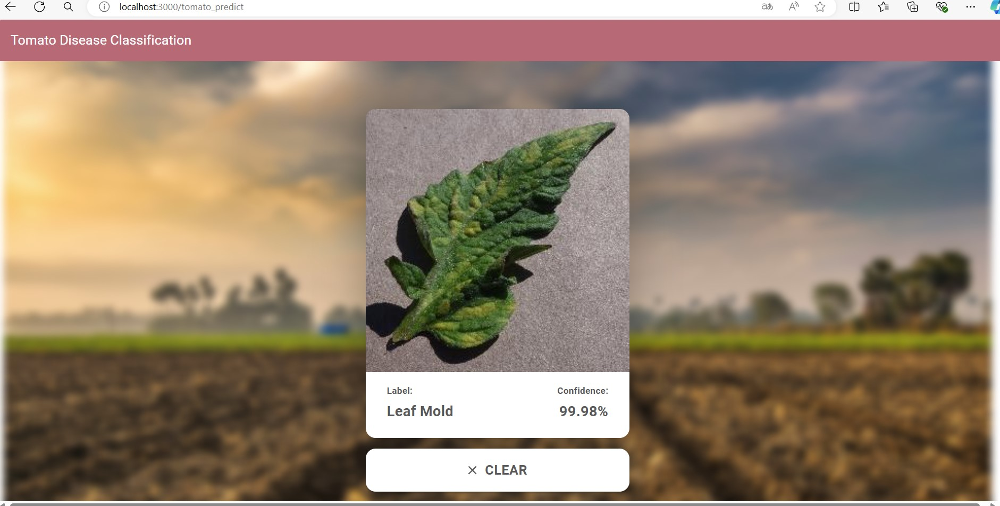
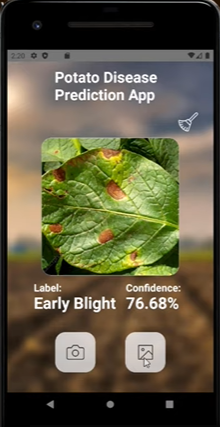

# Potato Disease Classification

##### This classifier is built with CNN models, and can be deployed both by a website application and a mobil application. It has the functionality of determine around 10 different diseases of pomato/tomato based on a photo of their leaf. The trained models have average accuracy around 95% and confidence above 97% for most cases. 

##### Code reference: https://github.com/codebasics/potato-disease-classification
##### Tutorial reference: https://www.youtube.com/playlist?list=PLeo1K3hjS3ut49PskOfLnE6WUoOp_2lsD

## Setup

### Setup for Python:

1. Install Python3.8 (https://www.python.org/downloads/release/python-380/)

2. Install Python packages

```
pip3 install -r training/requirements.txt
pip3 install -r api/requirements.txt
```

3. Install Tensorflow Serving ([Setup instructions](https://www.tensorflow.org/tfx/serving/setup))

### Setup for ReactJS

1. Install Nodejs ([Setup instructions](https://nodejs.org/en/download/package-manager/))
2. Install NPM ([Setup instructions](https://www.npmjs.com/get-npm))
3. Install dependencies

```bash
cd frontend
npm install --from-lock-json
npm audit fix
```

5. Change API url in `.env` is needed.

### Setup for React-Native app

1. Go to the [React Native environment setup](https://reactnative.dev/docs/environment-setup), then select `React Native CLI Quickstart` tab.  

2. Install dependencies

```bash
cd mobile-app-potato
yarn install
```

  - 2.1 Only for mac users
```bash
cd ios && pod install && cd ../
```

4. Change API url in `.env` is needed.

## Training the Model 

##### We use a convolutional neural network with data resizing and rescaling in the input layer, and Softmax activation function in the output layer. We also implemented data augumentation to imporve the performance. You can change the CNN architecture in the middle layers for a better performance if needed.

##### models/1 is the trained model for potato disease classification, and models/2 is the trained model for tomamto disease classification. If you want to train the model by yourself, you can follow the steps below.

### Steps:

1. Download the data from [kaggle](https://www.kaggle.com/arjuntejaswi/plant-village).
2. Only keep folders related to Potatoes/Tomato.
3. Run Jupyter Notebook in Browser.

```bash
jupyter notebook
```

4. Open `training/potato-disease-training.ipynb` or `training\potato-disease-classification-model-using-image-data-generator.ipynb` in Jupyter Notebook.
5. In cell #2, update the path to dataset. 
6. Follow the instructions in the notebook. Change variables values (i.e. n_classes) for potato/tomate respectively.
7. Run all the Cells one by one.
8. Copy the model generated and save it with the version number in the `models` folder.

## Website Deployment and Showcase

### Using FastAPI & TF Serve

1. Get inside `api` folder

```bash
cd api
```

2. Run the TF Serve 

```bash
docker run -t --rm -p 8501:8501 -v C:/Code/potato-disease-classification:/potato-disease-classification tensorflow/serving --rest_api_port=8501 --model_config_file=/potato-disease-classification/model.config.a
```

4. Run the FastAPI Server using uvicorn
   For this you can directly run it from your main.py using pycharm run option (as shown in the video tutorial)
   OR you can run it from command prompt as shown below,

```bash
uvicorn main:app --reload --host 0.0.0.0
```

5. Your API is now running at `0.0.0.0:8000`

### Running the Frontend

1. Get inside `api` folder

```bash
cd frontend
```
2. Run the frontend

```bash
npm run start
```

3. On the homepage, you can select to predict potato disease or tomato disease. Then you can upload the image on the website to get the predictions. Showcase as below:





## Mobile App Deployment and Showcase

### Deploying the TF Model (.h5) on GCP

##### My trigger urls (public but might be terminated later) :

```
https://us-central1-crafty-dynamics-328022.cloudfunctions.net/predict_potato
https://us-central1-crafty-dynamics-328022.cloudfunctions.net/predict_tomato

```
##### You can also deploy by yourself (and with your own model):

1. Create a [GCP account](https://console.cloud.google.com/freetrial/signup/tos?_ga=2.25841725.1677013893.1627213171-706917375.1627193643&_gac=1.124122488.1627227734.Cj0KCQjwl_SHBhCQARIsAFIFRVVUZFV7wUg-DVxSlsnlIwSGWxib-owC-s9k6rjWVaF4y7kp1aUv5eQaAj2kEALw_wcB).
2. Create a [Project on GCP](https://cloud.google.com/appengine/docs/standard/nodejs/building-app/creating-project) (Keep note of the project id).
3. Create a [GCP bucket](https://console.cloud.google.com/storage/browser/).
4. Upload the tf .h5 model generate in the bucket in the path `models/potato-model.h5`.
5. Install Google Cloud SDK ([Setup instructions](https://cloud.google.com/sdk/docs/quickstarts)).
6. Authenticate with Google Cloud SDK.

```bash
gcloud auth login
```

7. Run the deployment script.

```bash
cd gcp
gcloud functions deploy predict_potato --runtime python38 --trigger-http --memory 512 --project project_id
```

```bash
cd gcp
gcloud functions deploy predict_tomato --runtime python38 --trigger-http --memory 512 --project project_id
```

8. Your model is now deployed.
9. Use Postman to test the GCF using the [Trigger URL](https://cloud.google.com/functions/docs/calling/http).

Inspiration: https://cloud.google.com/blog/products/ai-machine-learning/how-to-serve-deep-learning-models-using-tensorflow-2-0-with-cloud-functions

### Running the app

1. Get inside `mobile-app-potato` folder

```bash
cd mobile-app-potato
```

2. Update `URL` to API URL in `.env` if needed.

3. Run the app (android/iOS)

```bash
npm run android
```

or

```bash
npm run ios
```

4. Creating public ([signed APK](https://reactnative.dev/docs/signed-apk-android))

5. Run the same steps for tomato disease classification in `mobile-app-tomato` folder

Note: currently still facing some compile errors on my local machine, the showcase is from https://www.youtube.com/watch?v=mSf0j8qkkFI&list=PLeo1K3hjS3ut49PskOfLnE6WUoOp_2lsD&index=8



## Future Improvement

For future improvement, I will fix the compile errors for the mobile app and combine the two mobile apps for tomato and potato into one.

I will also collect dataset and train the models to detect more kinds of plant diseases. 


